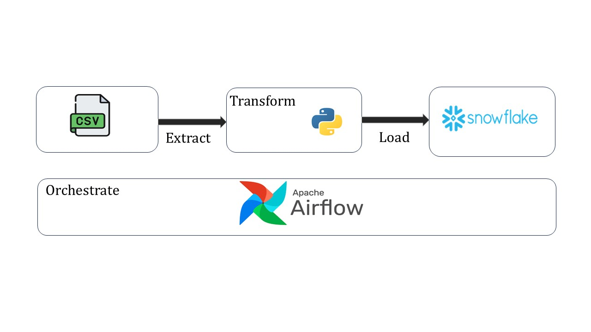

# ETL-Pipeline-Automation

## Overview
This project automates the process of Extracting, Transforming, and Loading (ETL) product data from CSV files into a Snowflake database using Apache Airflow. The pipeline ensures efficient handling of large datasets, automating the flow of data through scheduled and monitored processes, with retries for error handling.

## Architecture

## Technologies used
- **Programming Language** : Python
- **Data Processing** : Pandas
- **Workflow Orchestration** : Apache Airflow
- **Database** : Snowflake
- **File Handling** : CSV files

## Description:
Automated ETL Process: Designed a robust automated ETL pipeline using Apache Airflow that handles the full process from file extraction to loading in the Snowflake database.

Data Extraction: Efficiently extracts product data from CSV files, handling large datasets seamlessly with built-in error handling to ensure smooth execution.

Data Transformation: Data cleaning, formatting, and normalization using Pandas to ensure that the data is properly structured for loading into Snowflake.

Snowflake Integration: Successfully integrates and loads transformed data into a Snowflake database, ensuring scalability and high performance with cloud data warehousing.

Orchestration with Airflow: Airflow DAGs automate the ETL flow, managing task scheduling, logging, and retry mechanisms, ensuring proper task execution and reliability.

